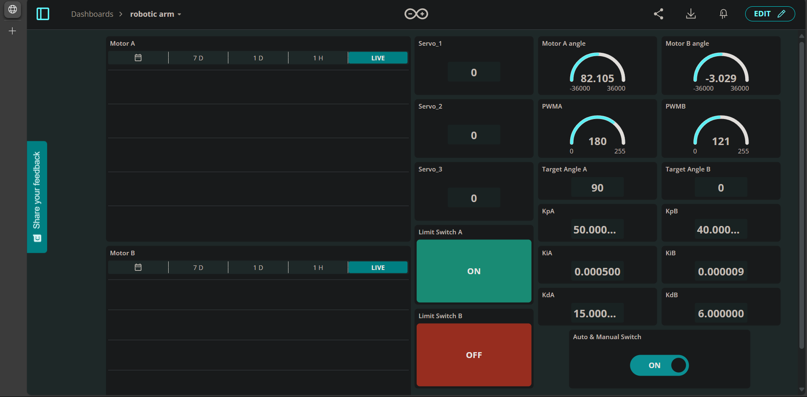
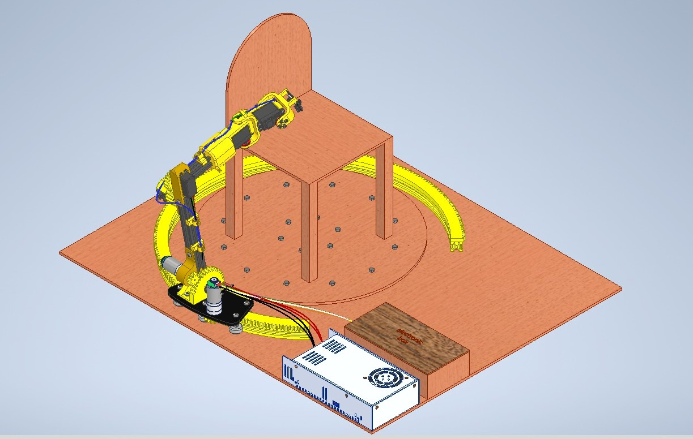
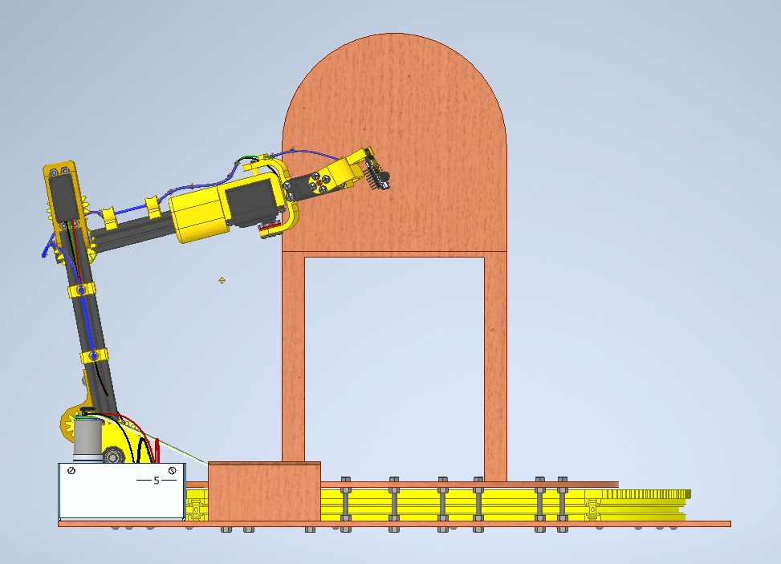
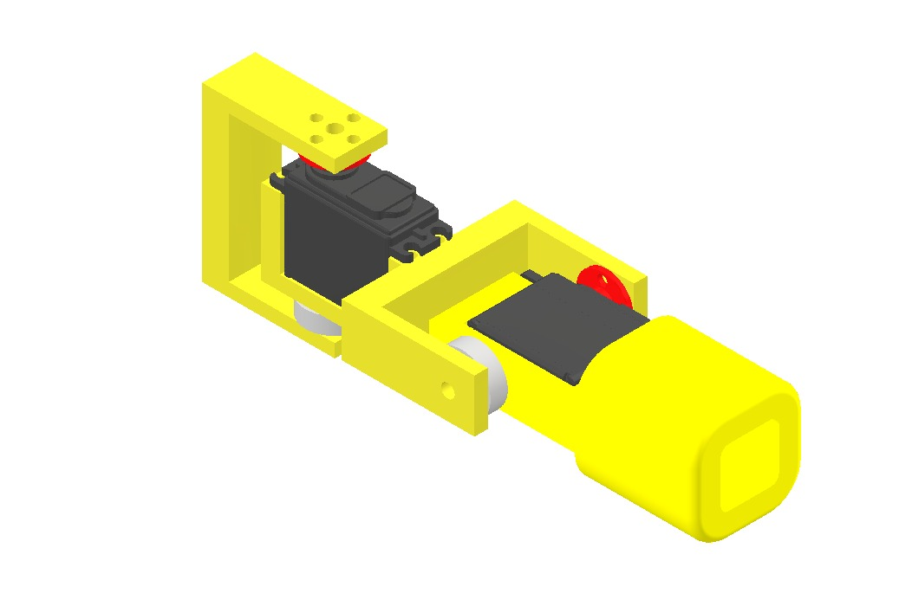

# 5-DOF Visual-Inspection Robotic Arm

A 5-degree-of-freedom robotic arm for automated visual inspection, combining servo-actuated joints, a rack-and-pinion rotating base (270° coverage), and an ESP32-CAM end-effector that recognizes targets on-device. Built end-to-end: mechanical design, custom electronics, kinematics & control, and an embedded AI vision model.

> Team project at Ain Shams University (Mechatronic System Design / Industrial Robotics, 2025). See *Credits*.

---

## Demo
▶ **[Watch the real arm run the full integrated system (video)](https://drive.google.com/file/d/1G8d9McYiD0UEVgwIUuDRzAie-aXbsvC7/view)**

Simulation (MATLAB / Simscape Multibody):
- ▶ [Inspection motion around the product](docs/sim_inspection_motion.mp4)
- ▶ [Forward-kinematics Simscape model](docs/sim_forward_kinematics.mp4)

## Highlights
- **5-DOF manipulator** — servo joints + rack-and-pinion base giving **270° rotation** around the inspected product.
- **On-device AI vision** — an **Edge Impulse** model deployed on an **ESP32-CAM** recognizes **15 letter targets** under varying angle and lighting.
- **Closed-loop PID** joint control, tunable **in real time via Arduino IoT Cloud** (live Kp/Ki/Kd, setpoint, and angle feedback on a dashboard).
- **Full kinematics in MATLAB** — forward & inverse kinematics, joint-space trajectory planning, and rigid-body-tree modeling (Simulink + Peter Corke Robotics Toolbox).
- **Custom hardware** — designed PCBs, 3D-printed joints/holders, and actuator sizing validated against MATLAB torque simulation.

## Tech stack
**Modeling & control:** MATLAB, Simulink, Peter Corke Robotics Toolbox, PID
**Embedded:** Arduino (C/C++), ESP32, ESP32-CAM, Arduino IoT Cloud
**AI/vision:** Edge Impulse (on-device inference)
**Hardware:** Autodesk Inventor (CAD), custom PCB, 3D printing
**Actuators/drivers:** DC motors w/ encoders (JGB-520), MG996 servos, L298N (DC), PCA9685 (servo)

## Robot parameters (standard DH)
| Joint | θ | d (mm) | a (mm) | α |
|------:|:--:|:------:|:------:|:----:|
| 1 | θ₁ | 65 | 277 | 90° |
| 2 | θ₂ | −37.5 | 192 | 0° |
| 3 | θ₃ | 17.5 | 172 | −90° |
| 4 | θ₄ | 0 | 62.5 | 90° |
| 5 | θ₅ | 0 | 45 | 0° |

## Repository structure
```
matlab/
├── peter_corke/        # forward/inverse kinematics (Peter Corke Toolbox)
├── simscape_sim/       # Simscape robot model + data files
└── simulink_control/   # cascaded control, DAQ, ESP32 motor block
firmware/
├── controlWithPot/       # PID joint control from a potentiometer setpoint
├── controlWithSetpoint/  # PID joint control from a fixed setpoint
└── arduino_iot_cloud/    # full ESP32 app: servo + DC PID + Arduino IoT Cloud dashboard
hardware/               # custom PCBs (Fritzing): base, DC, servo
docs/                   # dashboard screenshot
```

## Implementation
Key parts of the build:
- **Forward & inverse kinematics** and **joint-space trajectory planning** (Simulink + Peter Corke Robotics Toolbox), with rigid-body-tree modeling.
- **PID control** — designed/simulated in MATLAB/Simulink **and** implemented in Arduino firmware (encoder feedback + H-bridge, `PID_v1`).
- **Actuator sizing** from MATLAB torque simulation (RMS torque vs. selected motors/servos).
- **Custom PCB design** integrating the microcontroller, motor drivers (L298N / PCA9685), and power.
- **Integrated ESP32 application** tying the servo and DC-motor PID control together with a live Arduino IoT Cloud dashboard (`firmware/arduino_iot_cloud/`).

## Live control dashboard (Arduino IoT Cloud)
The arm connects to an **Arduino IoT Cloud** dashboard for live monitoring and tuning: the PID gains (Kp/Ki/Kd for both DC joints), servo and DC-motor setpoints, live joint-angle gauges, limit-switch status, and an automatic/manual mode switch, all adjustable in real time while the arm runs.



Firmware in [`firmware/arduino_iot_cloud/`](firmware/arduino_iot_cloud): open `Main_Code.ino`, fill your network and device credentials into `arduino_secrets.h`, select the ESP32 board, and flash.

## Design (CAD)
The full test rig: the arm sits on a 270° curved rack that carries it around the inspected product, with the electronics box and power supply alongside.

| Full assembly | Inspection pose | End-effector |
|:--:|:--:|:--:|
|  |  |  |

## Results
- 270° inspection sweep with repeatable joint positioning under PID control.
- On-device letter recognition across 15 classes (dataset reduced from 28→15 to fit the ESP32-CAM memory budget while keeping accuracy).

## How to run
- **MATLAB:** install the Peter Corke Robotics Toolbox, open `matlab/`, run the FK/IK scripts and the Simulink model.
- **Firmware:** open a sketch in `firmware/` in Arduino IDE (the full app is `firmware/arduino_iot_cloud/Main_Code.ino`), fill in `arduino_secrets.h`, select the ESP32 board, and flash.

## Credits
Team project at Ain Shams University (Mechatronics, 2025): Mohamed Refaie, Mina Ashraf, Mario Medhat, Mazen Mohamed, and Mariam Mahmoud.
